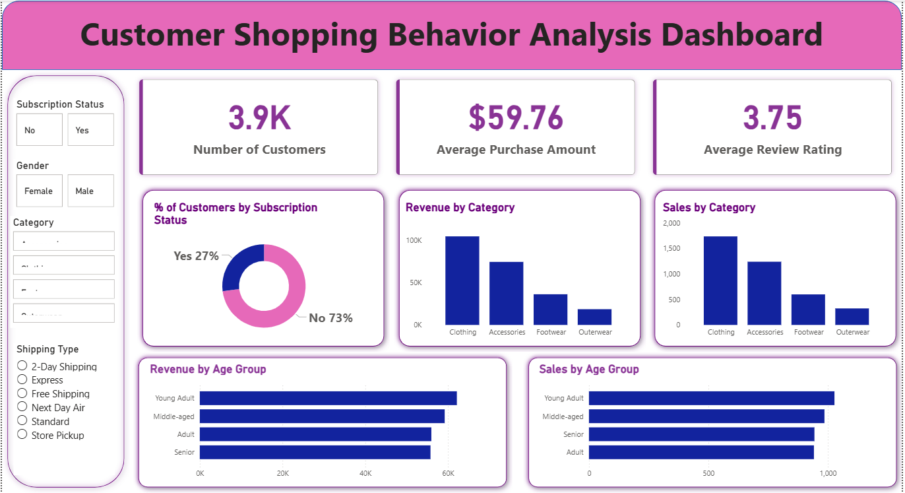

# 🛍️ Customer Shopping Behavior Analysis

## 📌 Project Overview
This project analyzes **3,900 customer transactions** to understand shopping behavior, spending patterns, and product preferences.

The goal is to generate **actionable business insights** that help organizations improve:
- Customer segmentation
- Marketing strategies
- Subscription growth
- Product positioning

---

## 📊 Dataset Summary

| Feature Type | Description |
|---------------|-------------|
| Customer Data | Age, Gender, Location, Subscription Status |
| Purchase Data | Item Purchased, Category, Purchase Amount, Season |
| Behavior Data | Discount Applied, Promo Code, Review Rating |
| Shopping Info | Shipping Type, Frequency of Purchases |

**Dataset Size**
- Rows: **3,900**
- Columns: **18**

---

## 🧹 Data Cleaning & Preparation (Python)

Data preprocessing was performed using **Python**:

- Loaded dataset using `pandas`
- Checked dataset structure using `df.info()`
- Generated statistics using `df.describe()`
- Handled **37 missing values** in `review_rating`
- Standardized column names to **snake_case**
- Created new features:
  - `age_group`
  - `purchase_frequency_days`
- Removed redundant column: `promo_code_used`

Cleaned data was then loaded into **PostgreSQL** for further analysis.

---

## 🗄️ Business Analysis Using SQL

Key business questions answered using SQL:

1. Revenue generated by **Male vs Female customers**
2. **High spending customers** who still use discounts
3. **Top 5 products by customer rating**
4. Comparison of **Standard vs Express shipping**
5. Spending comparison of **Subscribers vs Non-Subscribers**
6. Products **most dependent on discounts**
7. **Customer segmentation** (New, Returning, Loyal)
8. **Top 3 products per category**
9. Relationship between **repeat buyers and subscription**
10. **Revenue contribution by Age Group**

---

## 📊 Interactive Dashboard

An interactive dashboard was built using **Power BI** to visualize:

- Revenue trends
- Customer segmentation
- Product performance
- Subscription insights
- Shipping behavior

## Preview

---

## 💡 Key Insights

- **Subscribers spend more on average**
- **Loyal customers drive significant revenue**
- Discounts increase purchase frequency but may affect margins
- Certain **age groups contribute higher revenue**
- Express shipping customers tend to spend more

---

## 🛠️ Tools & Technologies

| Tool | Purpose |
|-----|--------|
| Python | Data Cleaning & Feature Engineering |
| Pandas | Data Manipulation |
| PostgreSQL | Data Analysis |
| SQL | Business Queries |
| Power BI | Dashboard & Visualization |

---

## 📂 Project Structure

Customer-Shopping-Behavior-Analysis
│
├── assets
│   └── Customer_Shopping_Behavior_Analysis_Dashboard.png
│
├── dataset
│   └── customer_shopping_behavior.csv
│
├── customer_behavior_dashboard.pbix
│
├── customer_behavior_sql_queries.sql
│
├── Customer_Shopping_Behavior_Analysis.ipynb
│
└── README.md

---

## 🚀 Business Recommendations

- Promote **subscription benefits**
- Implement **customer loyalty programs**
- Optimize **discount strategies**
- Focus marketing on **high-revenue age groups**
- Highlight **top-rated products in campaigns**

---

## 👤 Author

** Girish Raddi **
📧 girishraddiplc@gmail.com
---
