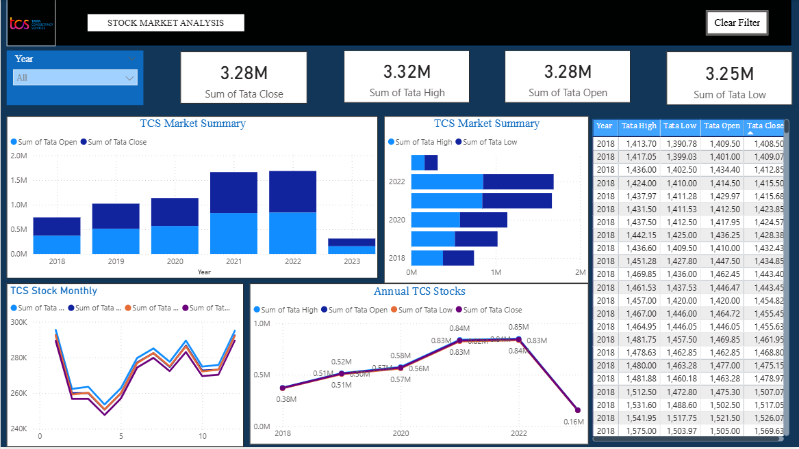

📊 TCS Stock Market Analysis | Power BI Dashboard

An interactive Power BI dashboard project analyzing historical stock performance of Tata Consultancy Services (TCS).
This project demonstrates data cleaning, financial analysis, data modeling, and interactive visualization skills relevant to a Data Analyst role.

The dashboard transforms raw stock market data into actionable insights about price trends, trading activity, and market behavior, enabling users to explore financial patterns and make data-driven observations.

📌 Project Overview

This project focuses on analyzing historical stock market data for TCS to understand how stock prices evolve over time. Using Power BI, the dataset is transformed into an interactive business intelligence dashboard that helps visualize:

📈 Stock price trends over time
📊 Trading volume fluctuations
📉 Market volatility
📌 Key financial indicators

The dashboard allows users to interactively explore the data through filters and dynamic visualizations.

🎯 Business Objective

The objective of this project is to:

  > Analyze historical stock price movement
  > Identify trends and volatility patterns
  > Evaluate trading activity and market behavior
  > Create a professional BI dashboard for financial data exploration
  > Demonstrate Power BI, DAX, and data visualization skills

📂 Dataset

The dataset contains historical TCS stock data
Source: Kaggle

The data was cleaned and transformed to support time-series financial analysis.

⚙️ Data Analysis Workflow
1️) Data Collection
    -- Historical TCS stock data was collected from Kaggle.

2️) Data Cleaning & Preparation
     -- Removed missing or inconsistent values
     -- Standardized data types
     -- Structured dataset for time-series analysis
     -- Prepared data using Power Query

3️) Data Modeling
     -- Created calculated measures using DAX
     -- Structured data for efficient analysis in Power BI

4️) Exploratory Data Analysis
    Analyzed trends in:
    -- Price movements
    -- Market fluctuations
    -- Trading volume patterns

5️) Dashboard Development
Designed interactive visuals to present financial insights clearly.

## Dashboard Preview

📊 Dashboard Features

📈 Stock Price Trend Analysis:
> Line charts showing how TCS stock prices change over time.

📊 Volume Analysis
> Visualization of daily trading volume to identify activity spikes.

📉 Market Volatility Insights
> Analysis of price fluctuations between high and low values.

📌 Key Performance Indicators (KPIs)

The dashboard tracks:

Average Stock Price

Highest Recorded Price

Lowest Recorded Price

Total Trading Volume

🔎 Interactive Filters

Users can explore the dashboard using filters such as:

Date range

Price metrics

Trading volume

🖼 Dashboard Preview

🛠 Tools & Technologies
Tool			Purpose
Power BI Desktop	Dashboard development
Power Query	Data cleaning & transformation
DAX	                   Calculated measures & analytics
Microsoft Excel	Initial data inspection
Kaggle	                   Dataset source

📁 Project Structure
TCS_Stock_Market_Analysis
│
├── assets
│   └── TCS_Stock_Market_Analysis_Dashboard.png
│
├── TCS Stock Market Analysis.pbix
│    
└── README.md

🚀 Key Skills Demonstrated

> Data Cleaning & Transformation
> Financial Data Analysis
> Power BI Dashboard Development
> Data Visualization
> DAX Calculations
> Time-Series Analysis
> Business Intelligence Reporting

💡 Project Value

This project showcases how business intelligence tools like Power BI can be used to analyze financial market data and create meaningful insights through visualization.

It demonstrates the ability to:

> Work with real-world financial datasets
> Perform data transformation and modeling
> Deliver interactive analytical dashboards

👩‍💻 Author

Girish Raddi
📧 girishraddiplc@gmail.com